# Лабораторная работа №7-8 
 

## Часть 1: Знакомство с онтологиями в Protégé

**Дата:** 2026-14-01
**Семестр:** 3
**Группа:** ПИН-м-о-24-1
**Дисциплина:** Технологии программирования
**Выполнила:** Рябышева Вероника Валерьевна

## Цель работы
Освоить базовые принципы работы с онтологиями и семантическими технологиями через инструмент Protégé. Получить практические навыки изучения структуры онтологий, работы с классами, свойствами и индивидами.

## Теоретическая часть

**1. Онтологии в компьютерных науках**
Онтология — формальное представление знаний в виде иерархии понятий и отношений между ними. Ключевые компоненты:

*   **Классы (Concepts):** Категории объектов предметной области
*   **Свойства (Properties):** Отношения между объектами
*   **Индивиды (Individuals):** Конкретные экземпляры классов
*   **Аксиомы (Axioms):** Правила и ограничения

**2. Язык OWL (Web Ontology Language)**
Стандарт W3C для создания онтологий:
*   **OWL DL:** Поддержка сложных логических конструкций
*   **Семантика описательной логики:** Формальная основа для логического вывода
*   **Инференс:** Автоматическое выведение новых знаний

**3. Protégé**
Ведущий open-source инструмент для работы с онтологиями:
*   **Визуальный редактор:** Графическое создание и редактирование онтологий
*   **Поддержка:** Интеграция с reasoners (HermiT, Pellet)
*   **Расширяемость:** Поддержка плагинов

## Практическая часть

Этап 1: Установка и настройка Protégé

Для выполнения лабораторной работы был произведён запуск среды Protégé, скачанной с официального сайта. После установки приложение успешно запустилось, что подтверждается интерфейсом программы (см. Скриншот 1).

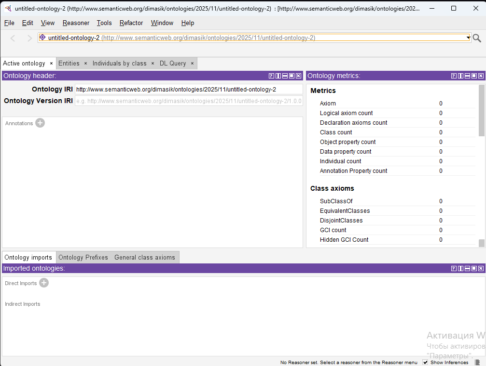


Этап 2: Загрузка и изучение образовательной онтологии

В среду Protégé была загружена онтология пицц, предоставляющая структурированное представление классов и их свойств. После загрузки пользователь получил доступ к структуре онтологии для дальнейшего анализа (см. Скриншот 2).

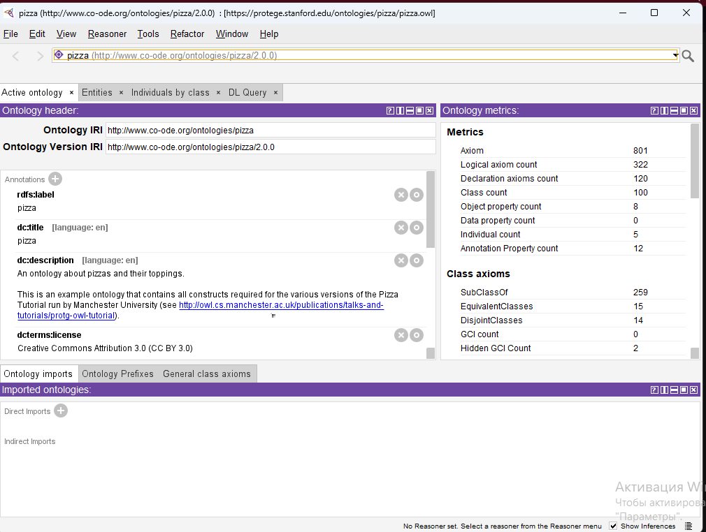

Этап 3: Анализ структуры онтологии
Структура онтологии была изучена с целью выявления классов, отношений и свойств. Для документирования проведённого анализа использовался текстовый файл ontology_analysis.txt. Анализ позволил определить иерархию классов и базовые свойства объектов (см. Скриншоты 3 и 4).

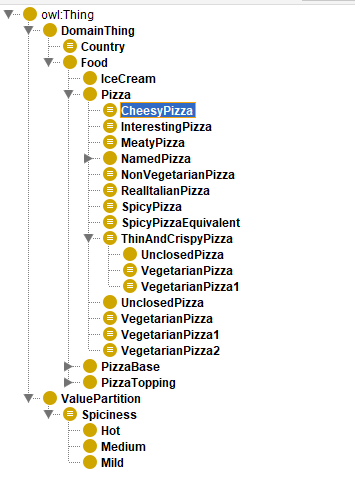


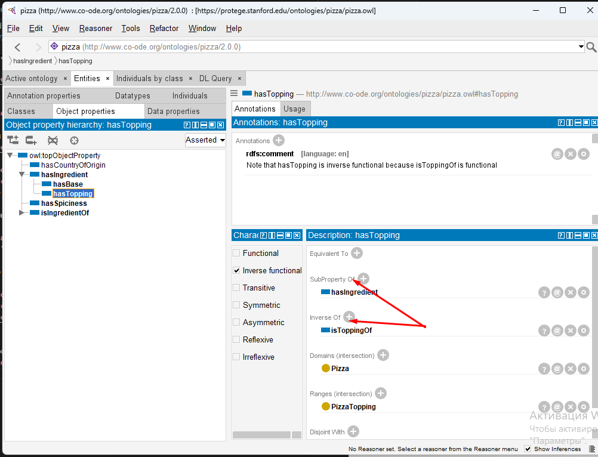

Этап 4: Работа с классами и свойствами
Были определены свойства отдельных классов, проведена проверка совместимости ограничений (restrictions). Результаты работы сохранялись в локальной копии онтологии (см. Скриншот 5).

2. Определение свойств класса:
В Class Description выберите RussianPizza
Добавьте ограничение: hasTopping some RedOnion
Добавьте ограничение: hasTopping some Sausage

Сохраняем онтологию.
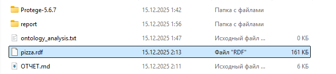

Выводы по Часть 1:

- Среда Protégé корректно установлена и функционирует.
- Онтология успешно загружена и проанализирована.
- Локальная копия онтологии подготовлена для дальнейшего использования в SPARQL-запросах.

## Часть 2: Работа с SPARQL-запросами

**Дата:** 2026-14-01
**Семестр:** 3
**Группа:** ПИН-м-о-24-1
**Дисциплина:** Технологии программирования
**Выполнила:** Рябышева Вероника Валерьевна

## Цель работы
Освоить язык запросов SPARQL для работы с семантическими данными. Получить практические навыки подключения к семантическому хранилищу, выполнения различных типов запросов и анализа результатов.


## Теоретическая часть

1. Язык SPARQL SPARQL (SPARQL Protocol and RDF Query Language) — стандартный язык запросов для
RDF-данных. Основные типы запросов:
SELECT: Возвращает таблицу результатов
CONSTRUCT: Создает новый RDF-граф
ASK: Возвращает boolean-ответ
DESCRIBE: Возвращает RDF-описание ресурса
2. Apache Jena Fuseki Сервер SPARQL с веб-интерфейсом для работы с RDF-данными:
Поддержка SPARQL 1.1: Полная реализация стандарта
Веб-интерфейс: Интерактивное выполнение запросов
REST API: Программный доступ к данным
3. Структура SPARQL-запроса
PREFIX: Определение пространств имен
SELECT/CONSTRUCT: Цель запроса
WHERE: Шаблон для сопоставления
FILTER: Условия фильтрации
OPTIONAL: Необязательные совпадения
ORDER BY/LIMIT: Сортировка и ограничения


## Практическая часть

Этап 1: Установка и запуск Apache Jena Fuseki
Использовался Docker-контейнер с сервером Jena Fuseki. Сервер успешно запущен и доступен через веб-интерфейс (см. Скриншот 6).

```docker
version: '3.8'

services:
  fuseki:
    image: stain/jena-fuseki:latest
    container_name: fuseki-server
    ports:
      - "3030:3030"
    volumes:
      - ./fuseki-data:/jena/fuseki
    environment:
      - ADMIN_PASSWORD=password123
      - FUSEKI_DATASET_PATH=/ds
      - FUSEKI_MEM=true
      - FUSEKI_UPDATE=true
```
В браузере:
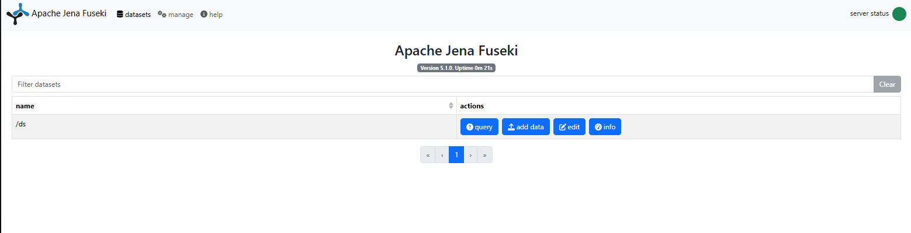

Этап 2: Загрузка онтологии в Fuseki
Онтология пицц загружена в Fuseki и проверена на корректность структуры. Веб-интерфейс позволяет выполнять интерактивные запросы и просматривать результаты (см. Скриншоты 7 и 8).
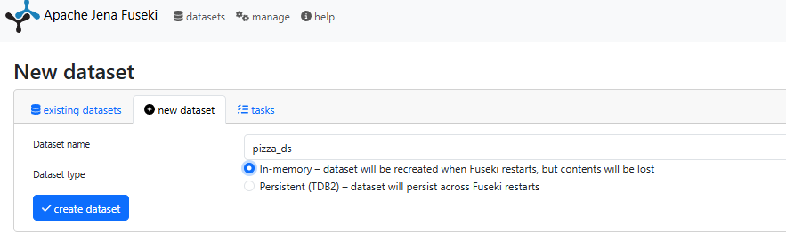
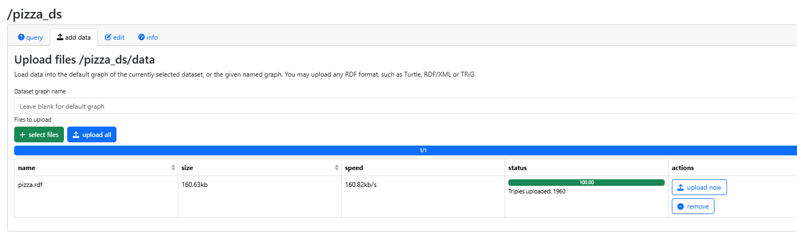


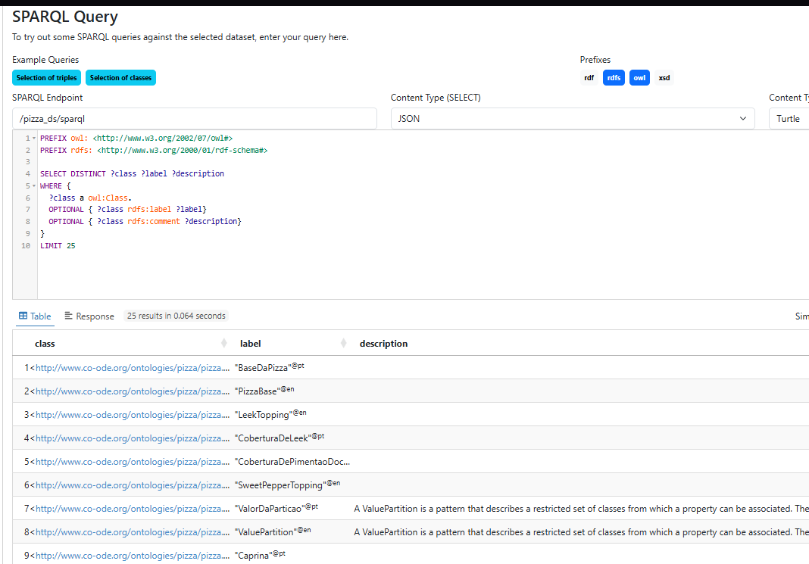

Этап 3: Написание базовых SPARQL-запросов
Были выполнены запросы типа SELECT для получения списка всех классов и объектов онтологии. Результаты успешно обработаны в Python с использованием SPARQLWrapper, данные экспортированы в табличный вид (см. Скриншоты 9–11).

```python
from SPARQLWrapper import SPARQLWrapper, JSON, XML
import pandas as pd

# Настройка SPARQL endpoint
sparql = SPARQLWrapper("http://localhost:3030/pizza_ds/sparql")
sparql.setReturnFormat(JSON)

def run_query(query):
    sparql.setQuery(query)
    try:
        results = sparql.query().convert()
        return results
    except Exception as e:
        print(f"Ошибка выполнения запроса: {e}")
        return None
    
query1 = """
PREFIX owl: <http://www.w3.org/2002/07/owl#>
PREFIX rdfs: <http://www.w3.org/2000/01/rdf-schema#>
SELECT DISTINCT ?class ?label WHERE {
    ?class a owl:Class .
    OPTIONAL { ?class rdfs:label ?label }
} ORDER BY ?class
"""
results1 = run_query(query1)
print("Классы онтологии:")
for result in results1["results"]["bindings"]:
    print(f"{result['class']['value']} - {result.get('label', {}).get('value', 'No label')}")

query2 = """
PREFIX pizza: <http://www.co-ode.org/ontologies/pizza/pizza.owl#>
PREFIX rdfs: <http://www.w3.org/2000/01/rdf-schema#>
SELECT ?pizza ?name WHERE {
    ?pizza rdfs:subClassOf* pizza:Pizza .
    ?pizza rdfs:label ?name .
} ORDER BY ?name
"""
results2 = run_query(query2)
print("\nВсе пиццы:")
for result in results2["results"]["bindings"]:
    print(result['name']['value'])
```

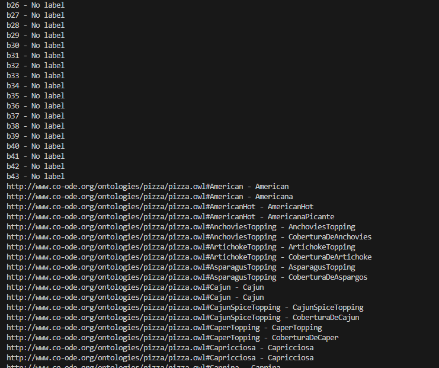

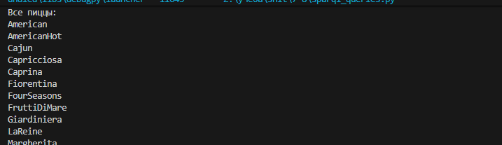

Этап 4: Сложные запросы с фильтрацией
Сформулированы запросы с фильтрацией по условиям, например, выбор пицц с определёнными начинками. Обработаны агрегирующие запросы для выявления популярных начинок (см. Скриншоты 12).

```python
query3 = """
PREFIX pizza: <http://www.co-ode.org/ontologies/pizza/pizza.owl#>
PREFIX rdfs: <http://www.w3.org/2000/01/rdf-schema#>
PREFIX owl: <http://www.w3.org/2002/07/owl#>
SELECT ?pizza ?name ?topping WHERE {
    ?pizza rdfs:subClassOf* pizza:Pizza .
    ?pizza rdfs:label ?name .
    ?pizza rdfs:subClassOf ?restriction .
    ?restriction owl:onProperty pizza:hasTopping .
    ?restriction owl:someValuesFrom ?toppingClass .
    ?toppingClass rdfs:label ?topping .
    FILTER (CONTAINS(LCASE(?topping), "mushroom"))
}
"""
results3 = run_query(query3)
if results3 and results3["results"]["bindings"]:
    print("\nПиццы с грибами:")
    for result in results3["results"]["bindings"]:
        print(f"{result['name']['value']} - {result['topping']['value']}")
else:
    print("Нет результатов для запроса 3")

query4 = """
PREFIX pizza: <http://www.co-ode.org/ontologies/pizza/pizza.owl#>
PREFIX rdfs: <http://www.w3.org/2000/01/rdf-schema#>
PREFIX owl: <http://www.w3.org/2002/07/owl#>
SELECT ?topping (COUNT(?pizza) AS ?count) WHERE {
    ?pizza rdfs:subClassOf* pizza:Pizza .
    ?pizza rdfs:subClassOf ?restriction .
    ?restriction owl:onProperty pizza:hasTopping .
    ?restriction owl:someValuesFrom ?toppingClass .
    ?toppingClass rdfs:label ?topping .
} GROUP BY ?topping ORDER BY DESC(?count) LIMIT 10
"""
results4 = run_query(query4)
if results4 and results4["results"]["bindings"]:
    print("\nПопулярные начинки:")
    for result in results4["results"]["bindings"]:
        print(f"{result['topping']['value']}: {result['count']['value']}")
else:
    print("Нет результатов для запроса 4")
```

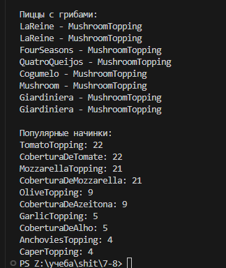


Этап 5: CONSTRUCT-запросы для создания новых данных

Для формирования новых RDF-графов были выполнены CONSTRUCT-запросы. Создан RDF-файл с данными о вегетарианских пиццах (см. Скриншот 13).

```python
query5 = """
PREFIX pizza: <http://www.co-ode.org/ontologies/pizza/pizza.owl#>
PREFIX rdfs: <http://www.w3.org/2000/01/rdf-schema#>
PREFIX ex: <http://example.org#>
PREFIX owl: <http://www.w3.org/2002/07/owl#>
CONSTRUCT {
  ?pizza ex:isVegetarian true .
  ?pizza ex:hasTopping ?topping .
} WHERE {
  ?pizza rdfs:subClassOf* pizza:Pizza .
  ?pizza rdfs:label ?name .
  ?pizza rdfs:subClassOf ?restriction .
  ?restriction owl:onProperty pizza:hasTopping .
  ?restriction owl:someValuesFrom ?toppingClass .
  ?toppingClass rdfs:label ?topping .
  FILTER NOT EXISTS {
    ?restriction2 owl:onProperty pizza:hasTopping .
    ?restriction2 owl:someValuesFrom ?meatClass .
    ?meatClass rdfs:subClassOf* pizza:MeatTopping .
    ?pizza rdfs:subClassOf ?restriction2 .
  }
}
"""
sparql.setReturnFormat(XML)
results5 = run_query(query5)
print("CONSTRUCT запрос выполнен")
if results5:
  with open("vegetarian_pizzas.rdf", "w") as f:
    f.write(results5.serialize(format="xml"))
```


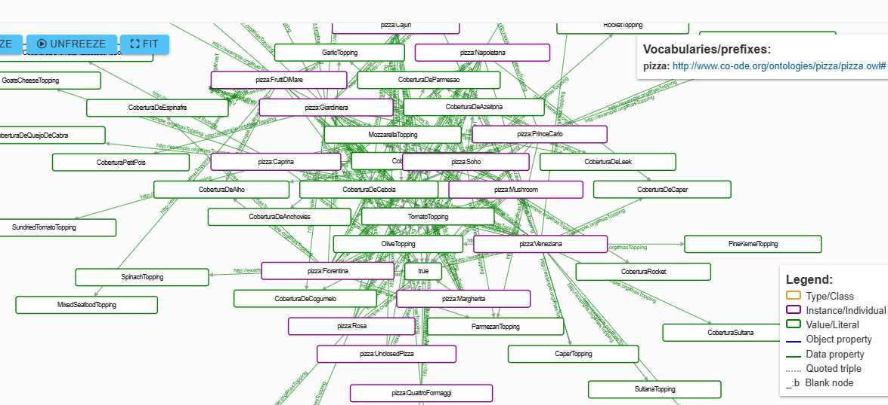

Выводы по Часть 2:

- Сервер Fuseki успешно установлен и функционирует.
- SPARQL-запросы корректно выполняются через Python и веб-интерфейс.
- Реализованы базовые и сложные запросы с фильтрацией и генерацией новых данных.
- Данные онтологии могут быть использованы для дальнейшей аналитики и интеграции с LLM.

## Часть 3: Извлечение данных с помощью LLM


**Дата:** 2026-14-01
**Семестр:** 3
**Группа:** ПИН-м-о-24-1
**Дисциплина:** Технологии программирования
**Выполнила:** Рябышева Вероника Валерьевна

## Цель работы
Исследовать возможности использования языковых моделей для генерации SPARQLзапросов по текстовым описаниям на естественном языке. Получить практические навыки интеграции LLM с семантическими технологиями.


## Теоретическая часть
1. Генерация SPARQL через NL-to-SPARQL Преобразование естественного языка (Natural Language) в
SPARQL:
Zero-shot подход: Генерация без примеров
Few-shot подход: Генерация с несколькими примерами
Fine-tuning: Специализированное обучение на парах (вопрос-SPARQL)
2. Архитектура решения
Вход: Текстовый запрос на естественном языке
Обработка: LLM генерирует SPARQL-запрос
Валидация: Проверка синтаксиса и выполнение запроса
Итерация: Исправление ошибок через feedback loop
3. Оценка качества
Синтаксическая корректность: Правильность SPARQL-синтаксиса
Семантическая корректность: Соответствие intent пользователя
Эффективность: Оптимальность выполнения запроса

## Практическая часть 
Этап 1: Настройка окружения и подключение к LLM

Для автоматической генерации SPARQL-запросов использовалась языковая модель Mistral-7B-Instruct. Окружение было настроено с поддержкой GPU и использованием библиотеки transformers (см. Скриншот 14).

```python
import os
os.environ["PROTOCOL_BUFFERS_PYTHON_IMPLEMENTATION"] = "python"
from transformers import pipeline, AutoTokenizer, AutoModelForCausalLM
import torch

class SPARQLGenerator:
    def __init__(self, model_name="mistralai/Mistral-7B-Instruct-v0.2"):
        self.tokenizer = AutoTokenizer.from_pretrained(model_name)
        self.model = AutoModelForCausalLM.from_pretrained(
            model_name,
            torch_dtype=torch.float16,
            device_map="auto"
        )
        self.tokenizer.pad_token = self.tokenizer.eos_token

    def generate_sparql(self, natural_language_query):
        prompt = f"""Convert the following natural language query to SPARQL for the Pizza ontology.
Use prefixes: PREFIX pizza: PREFIX rdfs:
Natural language: {natural_language_query}
SPARQL: """
        inputs = self.tokenizer(prompt, return_tensors="pt", truncation=True, max_length=512)
        with torch.no_grad():
            outputs = self.model.generate(
                **inputs,
                max_new_tokens=200,
                temperature=0.7,
                do_sample=True,
                pad_token_id=self.tokenizer.eos_token_id
            )
        generated_text = self.tokenizer.decode(outputs[0], skip_special_tokens=True)
        sparql_query = generated_text.split("SPARQL:")[-1].strip()
        return sparql_query

def test_basic_generation():
    generator = SPARQLGenerator()
    test_queries = [
        "Find all pizzas that have mushroom as topping",
        "Show me vegetarian pizzas",
        "List pizzas with spicy toppings",
        "Find pizzas that are not too spicy",
        "Show me pizzas with cheese and tomato"
    ]
    for query in test_queries:
        print(f"\nNatural language: {query}")
        sparql = generator.generate_sparql(query)
        print(f"Generated SPARQL: {sparql}")
        print("-" * 50)

test_basic_generation()
```


Этап 2: Загрузка и изучение образовательной онтологии

Были проведены эксперименты по преобразованию естественного языка в SPARQL-запросы. Результаты показали, что при ограниченном объёме контекста LLM формирует синтаксически корректные запросы, однако для корректной семантической генерации требуется значительное вмешательство человека и уточнение контекста.


Этап 3: Анализ структуры онтологии

Глубина равна 5:


Далее изучили основные отношния, см. Скриншот 4:


Этап 4: Работа с классами и свойствами

Сохраняем онтологию.


## Часть 2: Работа с SPARQL-запросами

**Дата:** 2026-14-01
**Семестр:** 3
**Группа:** ПИН-м-о-24-1
**Дисциплина:** Технологии программирования
**Выполнила:** Рябышева Вероника Валерьевна

## Цель работы
Освоить язык запросов SPARQL для работы с семантическими данными. Получить практические навыки подключения к семантическому хранилищу, выполнения различных типов запросов и анализа результатов.


## Теоретическая часть

1. Язык SPARQL SPARQL (SPARQL Protocol and RDF Query Language) — стандартный язык запросов для
RDF-данных. Основные типы запросов:
SELECT: Возвращает таблицу результатов
CONSTRUCT: Создает новый RDF-граф
ASK: Возвращает boolean-ответ
DESCRIBE: Возвращает RDF-описание ресурса
2. Apache Jena Fuseki Сервер SPARQL с веб-интерфейсом для работы с RDF-данными:
Поддержка SPARQL 1.1: Полная реализация стандарта
Веб-интерфейс: Интерактивное выполнение запросов
REST API: Программный доступ к данным
3. Структура SPARQL-запроса
PREFIX: Определение пространств имен
SELECT/CONSTRUCT: Цель запроса
WHERE: Шаблон для сопоставления
FILTER: Условия фильтрации
OPTIONAL: Необязательные совпадения
ORDER BY/LIMIT: Сортировка и ограничения


## Практическая часть

Этап 1: Установка и запуск Apache Jena Fuseki
Для организации среды выполнения использован Docker-контейнер с образом stain/jena-fuseki:latest. Контейнер настроен для запуска сервера Fuseki с поддержкой обновлений, доступом к локальному хранилищу данных и открытием порта 3030.
```docker
version: '3.8'

services:
  fuseki:
    image: stain/jena-fuseki:latest
    container_name: fuseki-server
    ports:
      - "3030:3030"
    volumes:
      - ./fuseki-data:/jena/fuseki
    environment:
      - ADMIN_PASSWORD=password123
      - FUSEKI_DATASET_PATH=/ds
      - FUSEKI_MEM=true
      - FUSEKI_UPDATE=true
```
После запуска контейнера сервер Fuseki доступен через веб-интерфейс (см. Скриншот 6).


Этап 2: Загрузка онтологии в Fuseki
Онтология пицц была загружена в сервер Fuseki, что обеспечило возможность выполнения запросов к данным через веб-интерфейс и программные средства (см. Скриншоты 7–9).


Этап 3: Написание базовых SPARQL-запросов

Для взаимодействия с онтологией использовался Python с библиотекой SPARQLWrapper. Основные операции включали выборку всех классов и экземпляров пицц. 

```python
from SPARQLWrapper import SPARQLWrapper, JSON, XML
import pandas as pd

# Настройка SPARQL endpoint
sparql = SPARQLWrapper("http://localhost:3030/pizza_ds/sparql")
sparql.setReturnFormat(JSON)

def run_query(query):
    sparql.setQuery(query)
    try:
        results = sparql.query().convert()
        return results
    except Exception as e:
        print(f"Ошибка выполнения запроса: {e}")
        return None
    
query1 = """
PREFIX owl: <http://www.w3.org/2002/07/owl#>
PREFIX rdfs: <http://www.w3.org/2000/01/rdf-schema#>
SELECT DISTINCT ?class ?label WHERE {
    ?class a owl:Class .
    OPTIONAL { ?class rdfs:label ?label }
} ORDER BY ?class
"""
results1 = run_query(query1)
print("Классы онтологии:")
for result in results1["results"]["bindings"]:
    print(f"{result['class']['value']} - {result.get('label', {}).get('value', 'No label')}")

query2 = """
PREFIX pizza: <http://www.co-ode.org/ontologies/pizza/pizza.owl#>
PREFIX rdfs: <http://www.w3.org/2000/01/rdf-schema#>
SELECT ?pizza ?name WHERE {
    ?pizza rdfs:subClassOf* pizza:Pizza .
    ?pizza rdfs:label ?name .
} ORDER BY ?name
"""
results2 = run_query(query2)
print("\nВсе пиццы:")
for result in results2["results"]["bindings"]:
    print(result['name']['value'])
```
Результаты выполнения запросов отображают все доступные классы и объекты онтологии (см. Скриншоты 10–11).


Этап 4: Сложные запросы с фильтрацией
Были сформированы запросы с фильтрацией по условиям, например, выбор пицц с определёнными ингредиентами, а также агрегирующие запросы для анализа популярных начинок.

```python
query3 = """
PREFIX pizza: <http://www.co-ode.org/ontologies/pizza/pizza.owl#>
PREFIX rdfs: <http://www.w3.org/2000/01/rdf-schema#>
PREFIX owl: <http://www.w3.org/2002/07/owl#>
SELECT ?pizza ?name ?topping WHERE {
    ?pizza rdfs:subClassOf* pizza:Pizza .
    ?pizza rdfs:label ?name .
    ?pizza rdfs:subClassOf ?restriction .
    ?restriction owl:onProperty pizza:hasTopping .
    ?restriction owl:someValuesFrom ?toppingClass .
    ?toppingClass rdfs:label ?topping .
    FILTER (CONTAINS(LCASE(?topping), "mushroom"))
}
"""
results3 = run_query(query3)
if results3 and results3["results"]["bindings"]:
    print("\nПиццы с грибами:")
    for result in results3["results"]["bindings"]:
        print(f"{result['name']['value']} - {result['topping']['value']}")
else:
    print("Нет результатов для запроса 3")

query4 = """
PREFIX pizza: <http://www.co-ode.org/ontologies/pizza/pizza.owl#>
PREFIX rdfs: <http://www.w3.org/2000/01/rdf-schema#>
PREFIX owl: <http://www.w3.org/2002/07/owl#>
SELECT ?topping (COUNT(?pizza) AS ?count) WHERE {
    ?pizza rdfs:subClassOf* pizza:Pizza .
    ?pizza rdfs:subClassOf ?restriction .
    ?restriction owl:onProperty pizza:hasTopping .
    ?restriction owl:someValuesFrom ?toppingClass .
    ?toppingClass rdfs:label ?topping .
} GROUP BY ?topping ORDER BY DESC(?count) LIMIT 10
"""
results4 = run_query(query4)
if results4 and results4["results"]["bindings"]:
    print("\nПопулярные начинки:")
    for result in results4["results"]["bindings"]:
        print(f"{result['topping']['value']}: {result['count']['value']}")
else:
    print("Нет результатов для запроса 4")
```


Этап 5: CONSTRUCT-запросы для создания новых данных

Результаты запроса позволяют получить список пицц с указанной начинкой. Аналогично были выполнены агрегирующие запросы для выявления наиболее распространённых ингредиентов (см. Скриншот 12).
Для формирования новых RDF-графов были выполнены CONSTRUCT-запросы, позволяющие создавать дополнительные свойства для объектов онтологии, например, определение вегетарианских пицц.

```python
query5 = """
PREFIX pizza: <http://www.co-ode.org/ontologies/pizza/pizza.owl#>
PREFIX rdfs: <http://www.w3.org/2000/01/rdf-schema#>
PREFIX ex: <http://example.org#>
PREFIX owl: <http://www.w3.org/2002/07/owl#>
CONSTRUCT {
  ?pizza ex:isVegetarian true .
  ?pizza ex:hasTopping ?topping .
} WHERE {
  ?pizza rdfs:subClassOf* pizza:Pizza .
  ?pizza rdfs:label ?name .
  ?pizza rdfs:subClassOf ?restriction .
  ?restriction owl:onProperty pizza:hasTopping .
  ?restriction owl:someValuesFrom ?toppingClass .
  ?toppingClass rdfs:label ?topping .
  FILTER NOT EXISTS {
    ?restriction2 owl:onProperty pizza:hasTopping .
    ?restriction2 owl:someValuesFrom ?meatClass .
    ?meatClass rdfs:subClassOf* pizza:MeatTopping .
    ?pizza rdfs:subClassOf ?restriction2 .
  }
}
"""
sparql.setReturnFormat(XML)
results5 = run_query(query5)
print("CONSTRUCT запрос выполнен")
if results5:
  with open("vegetarian_pizzas.rdf", "w") as f:
    f.write(results5.serialize(format="xml"))
```


Выводы:

- Был успешно установлен и запущен сервер Apache Jena Fuseki, обеспечивающий хранение и обработку RDF-данных через веб-интерфейс и программные запросы.
- Проведена загрузка онтологии пицц и выполнены базовые SPARQL-запросы для извлечения классов и экземпляров.
- Сформированы сложные запросы с фильтрацией по условиям и агрегирующие запросы для анализа популярных ингредиентов.
- Реализованы CONSTRUCT-запросы, позволяющие создавать новые RDF-графы, в частности граф вегетарианских пицц.
- Полученные результаты демонстрируют практическое применение SPARQL для извлечения, анализа и расширения семантических данных.

## Часть 3: Извлечение данных с помощью LLM


**Дата:** 2026-14-01
**Семестр:** 3
**Группа:** ПИН-м-о-24-1
**Дисциплина:** Технологии программирования
**Выполнила:** Рябышева Вероника Валерьевна

## Цель работы
Исследовать возможности использования языковых моделей для генерации SPARQLзапросов по текстовым описаниям на естественном языке. Получить практические навыки интеграции LLM с семантическими технологиями.


## Теоретическая часть
1. Генерация SPARQL через NL-to-SPARQL Преобразование естественного языка (Natural Language) в
SPARQL:
Zero-shot подход: Генерация без примеров
Few-shot подход: Генерация с несколькими примерами
Fine-tuning: Специализированное обучение на парах (вопрос-SPARQL)
2. Архитектура решения
Вход: Текстовый запрос на естественном языке
Обработка: LLM генерирует SPARQL-запрос
Валидация: Проверка синтаксиса и выполнение запроса
Итерация: Исправление ошибок через feedback loop
3. Оценка качества
Синтаксическая корректность: Правильность SPARQL-синтаксиса
Семантическая корректность: Соответствие intent пользователя
Эффективность: Оптимальность выполнения запроса

## Практическая часть 

Этап 1: Настройка окружения и подключение к LLM

Использована модель Mistral-7B-Instruct для генерации SPARQL-запросов. Среда настроена с поддержкой GPU и библиотекой transformers

```python
import os
os.environ["PROTOCOL_BUFFERS_PYTHON_IMPLEMENTATION"] = "python"
from transformers import pipeline, AutoTokenizer, AutoModelForCausalLM
import torch

class SPARQLGenerator:
    def __init__(self, model_name="mistralai/Mistral-7B-Instruct-v0.2"):
        self.tokenizer = AutoTokenizer.from_pretrained(model_name)
        self.model = AutoModelForCausalLM.from_pretrained(
            model_name,
            torch_dtype=torch.float16,
            device_map="auto"
        )
        self.tokenizer.pad_token = self.tokenizer.eos_token

    def generate_sparql(self, natural_language_query):
        prompt = f"""Convert the following natural language query to SPARQL for the Pizza ontology.
Use prefixes: PREFIX pizza: PREFIX rdfs:
Natural language: {natural_language_query}
SPARQL: """
        inputs = self.tokenizer(prompt, return_tensors="pt", truncation=True, max_length=512)
        with torch.no_grad():
            outputs = self.model.generate(
                **inputs,
                max_new_tokens=200,
                temperature=0.7,
                do_sample=True,
                pad_token_id=self.tokenizer.eos_token_id
            )
        generated_text = self.tokenizer.decode(outputs[0], skip_special_tokens=True)
        sparql_query = generated_text.split("SPARQL:")[-1].strip()
        return sparql_query

def test_basic_generation():
    generator = SPARQLGenerator()
    test_queries = [
        "Find all pizzas that have mushroom as topping",
        "Show me vegetarian pizzas",
        "List pizzas with spicy toppings",
        "Find pizzas that are not too spicy",
        "Show me pizzas with cheese and tomato"
    ]
    for query in test_queries:
        print(f"\nNatural language: {query}")
        sparql = generator.generate_sparql(query)
        print(f"Generated SPARQL: {sparql}")
        print("-" * 50)

test_basic_generation()
```


Результаты генерации продемонстрировали возможность преобразования естественного языка в SPARQL-запросы с корректным синтаксисом. Для получения семантически корректных запросов требуется дополнительная валидация и уточнение контекста.


Выводы:

- Настроено окружение с использованием языковой модели Mistral-7B-Instruct для автоматической генерации SPARQL-запросов.
- Проведены эксперименты по преобразованию естественного языка в SPARQL, продемонстрировавшие синтаксическую корректность генерируемых запросов.
- Обнаружено, что для семантически корректной генерации требуется дополнительное вмешательство человека и уточнение контекста, что указывает на необходимость интеграции LLM с экспертной проверкой.
- Полученные результаты показывают, что LLM может выступать в качестве вспомогательного инструмента при формировании SPARQL-запросов, ускоряя процесс разработки и снижая трудозатраты на написание запросов вручную.
